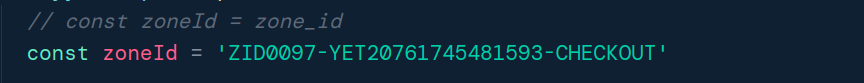

# Dynamatic Personalized Upsells' Widget

Repository containing widgets of Dynamatic Personalized Upsells app. This repo consists of checkout, post purchase, order status and theme widgets.

## Prerequisites
Ensure the following software is installed on your system:
* `bun >= 1.2.20`
* `python3 >= 3.12.3`
* `make >= 4.4.1`
* `@shopify/cli >= 3.80.0`
* [`dynamatic-cart`](https://github.com/devsnestllc/dynamatic-cart)

⚠ We use Bun as the JavaScript runtime for this project. To avoid bugs and unexpected behavior, please use Bun and its package manager.

## How to run checkout, thank you, and order status extensions

1. Clone this repository and run `bun i`. (bun version 1.2.20)
   ```bash
   bun i
   ```
   checkout the correct branch if needed.

2. Run `shopify app dev --reset` for the first time. For subsequent runs, use `shopify app dev`.
   If running for the first time, configure the store and select the dev dynamatics app.

3. Locate the `Main.tsx` file for your desired extension (Checkout, Thank You, or Order Status).
   - For Checkout: `extensions/dynamatic-zone/src/Main.tsx`
   - For Thank You: `extensions/dynamatic-zone-thank-you/src/Main.tsx`
   - For Order Status: `extensions/dynamatic-zone-order-status/src/Main.tsx`

4. Copy the Zone ID from the Dynamatic dashboard. Find the `zoneId` variable in the `Main.tsx` file, comment out the line `const zoneId = zone_id`, and replace it with your copied Zone ID.

   

5. To check live changes without reloading, run the following command in the terminal:
   ```bash
   # example terminal command
   extensions/dynamatic-zone-thank-you/src/Main.tsx
   ```
   *(Replace with your desired extension path)*

## Deployment
To deploy these extensions on Shopify, follow the steps below:

1. Clone this repo and [`dynamatic-cart`](https://github.com/devsnestllc/dynamatic-cart) to the same directory.
2. Checkout the main branch.
3. Install project dependencies. Do not change the directory; run the installation command from the root of the project.
4. Open the `dynamatic-cart` repo.
5. For development, run `APP_RUNNING_MODE=development bun run build`. For production, run `APP_RUNNING_MODE=production bun run build`.
6. Copy the built JavaScript and CSS assets to the `assets` directory of `theme-extensions` inside the `extensions` directory.
7. Run `bun run --bun deploy.ts --dev` to deploy to the development app and `bun run --bun deploy.ts --prod` for production.
